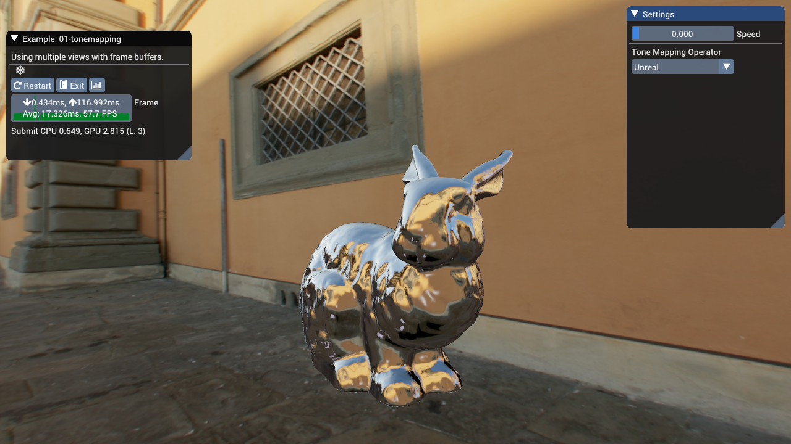
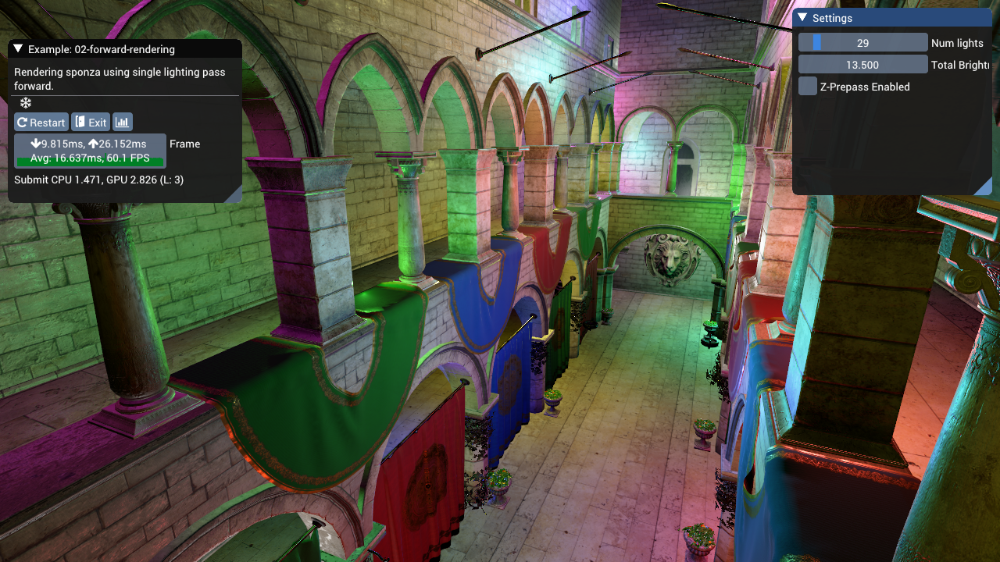
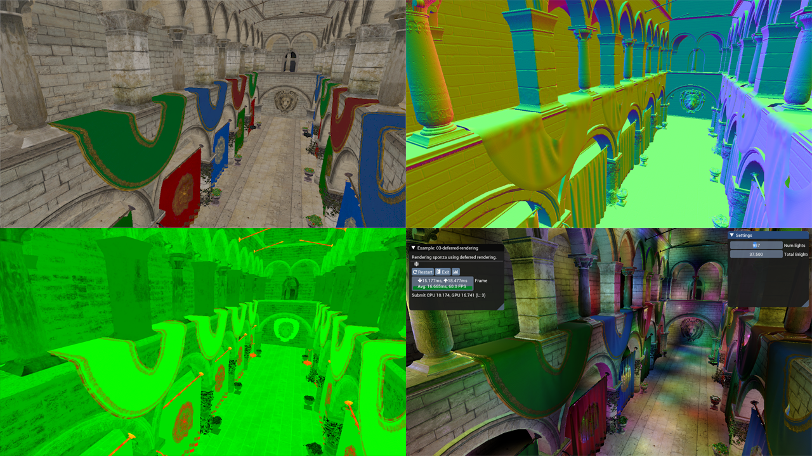
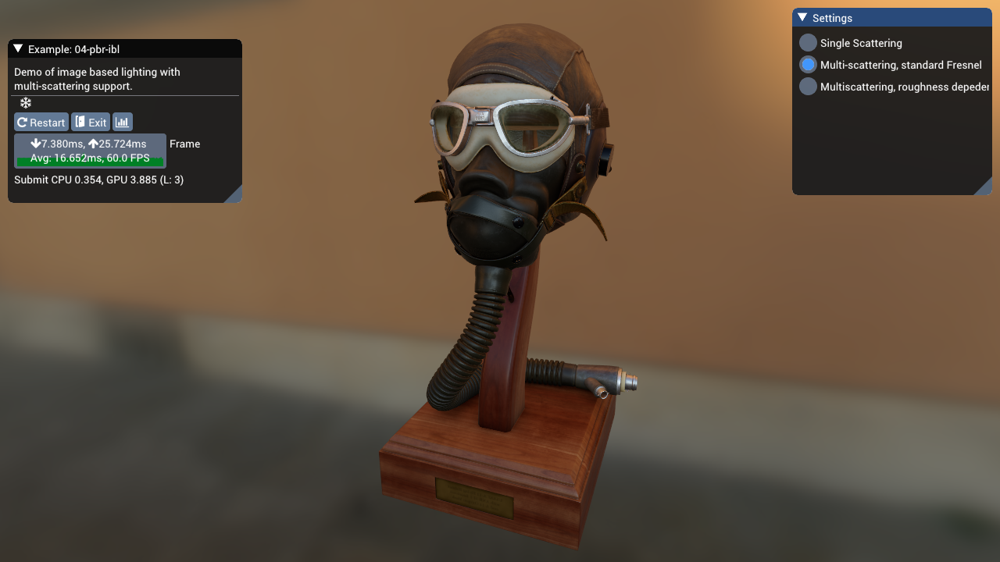

# Bruno's Awful Examples (bae)

Used to be Bruno's Awful Engine, but decided it was better to focus on small little examples, like what is found in the bgfx repo.

- [Bruno's Awful Examples (bae)](#brunos-awful-examples-bae)
  - [Getting started](#getting-started)
  - [Linux](#linux)
    - [Note on non-DirectX11 backends](#note-on-non-directx11-backends)
  - [Dependencies](#dependencies)
  - [Using GLTF files](#using-gltf-files)
- [The Examples](#the-examples)
  - [Tone Mapping](#tone-mapping)
  - [Forward vs. Deferred Rendering](#forward-vs-deferred-rendering)
    - [Forward](#forward)
    - [Deferred](#deferred)
    - [Future Work](#future-work)
  - [Physically Based Image Based Lighting](#physically-based-image-based-lighting)
  - [Cascaded Shadow Maps](#cascaded-shadow-maps)
    - [TODOS](#todos)

## Getting started

```
git clone git@github.com:BruOp/bae.git
cd bae
git submodule update --init --recursive
```

Windows

```
make setup
```

You'll also need to build `shaderc` (it should be part of the generated solution) and then copy it to `deps/bgfx/tools/bin/windows/shaderc` (or whatever platform you're using). This will elt you build the shaders inside each example using the makefile.

You may need to install all the system-level dependencies for `bgfx` on your own though :( Follow the bgfx build instructions for this part. This repo doesn't introduce any new system level deps.

## Linux

On linux, you'll probably have to download a whole bunch of `devel` packages. Install the ones for bgfx listed [here](https://bkaradzic.github.io/bgfx/build.html). For Solus Distro, the packages names were totally different, so I ran:

```zsh
sudo eopkg install libglu libglu-devel libx11 libx11-devel xorg-server xorg-server-devel
```

### Note on non-DirectX11 backends

I have not tested the examples on backends other than D3D11. I ran into issues getting my first example to work properly on OpenGL due to some uniforms being created out-of-order by the library. In the end I decided to focus on getting things to work on D3D11 and not lose too much time worrying about the other backends. I'm disappointed too.

## Dependencies

There's a few different dependencies included in the repo that are used in the examples. The biggest are obviously [bgfx](), [bx]() and [bimg](). Those are included as git submodules and are included as part of the solution generation step that is run using `make setup`.

All the other dependencies are header only and located in the `external` folder:

- [`glm`](https://glm.g-truc.net/0.9.9/index.html) for linear algebra (and I recognize there is overlap with bx here)
- [`mikktspace`](https://github.com/tcoppex/ext-mikktspace) for generation of missing tangent vectors on meshes
- [`tinyobjloader`](https://github.com/syoyo/tinyobjloader) for loading .obj files
- [`tinygltf`](https://github.com/syoyo/tinygltf) for parsing and loading binary data from .gltf files. See the note below for some caveats to my implementation.

## Using GLTF files

There's an GLTF loader in `PhysicallyBasedScene.cpp` that doesn't support the spec fully. Additionally, since BGFX doesn't expose any way of generating mip maps for textures a la `glGenMipmaps`, we have to pre-process the GLTF files to produce mip-mapped DDS versions of the source textures.

To pre-process the GLTFs you'll need `python` 3.7 or greater installed (sorry), and then you can run the following from the project root:

```bash
python3 scripts/convert_textures.py path/to/Source/GLTF/file.gltf examples/runtime/meshes/output_dir
```

# The Examples

The primary reason for this repo's existence is to house examples of different technique that I'm learning about. So far the examples include:

1. Tone Mapping
2. Forward Rendering
3. Deferred Rendering
4. Image Based Lighting
5. Cascaded Shadow Mapping

The rough list of things I still plan on adding include:

- Skinning and Animation support
- Temporal Anti-Aliasing :fearful:
- Motion Blur
- Linearly Transformed Cosine Area Lights :grimacing:
- Depth of Field
- Clustered Rendering

Here's a summary for each technique:

## Tone Mapping



While the BGFX repo already contains an example of HDR tone-mapping, it is implemented using a chain of down-sampled textures and operators like the Uncharted and Reinhard curves. I was interested in implementing a more modern approach, so my implementation has a few differences.

It uses a compute shader to construct a luminance histogram of the input HDR framebuffer, and another that performs a weighted average using the histogramto obtain an average luminance.

That's used to create an exposure value which we can then use to scale our input luminance, which we then feed into different tone map operators. The example includes a few different operators:

- [Reinhard](http://www.cs.utah.edu/~reinhard/cdrom/tonemap.pdf) with variable white point
- Unreal, based off ACES with built in gamma correction
- [Lottes](http://32ipi028l5q82yhj72224m8j.wpengine.netdna-cdn.com/wp-content/uploads/2016/03/GdcVdrLottes.pdf)
- [Uchimura](https://www.desmos.com/calculator/gslcdxvipg)

For more detail and comparisons, please see these two blog posts I've written documenting the process:

- [Automatic Exposure Using a Luminance Histogram](https://bruop.github.io/exposure/)
- [Tone Mapping](https://bruop.github.io/tonemapping/)

## Forward vs. Deferred Rendering



The two examples `02-forward-rendering` and `03-deferred-rendering` are set up to be largely identical, but with a few key differences to highlight the strengths and weaknesses of forward vs deferred rendering.

Both examples render a version of the [Sponza scene](https://github.com/KhronosGroup/glTF-Sample-Models/tree/master/2.0/Sponza) that includes textures for the "metallic-roughness" workflow. We use a fairly standard single-scattering BRDF:

- Trowbridge-Reitz (GGX) normal distribution
- Smith correlated visibility term
- Schlick Fresnel Approximation

With some additional GLTF features supported:

- Occlusion texture
- Emissive texture
- Base color, emissive, metallic and roughness factors

### Forward

The forward renderer supports up to 255 point lights in the scene, but there is no culling of the lights evaluated per draw call, so slow down happens quickly (after about 50 lights on my machine). The light data is passed using uniform arrays and evaluated through a simple for loop. We only evaluate the BRDF if the light's incident value is zero, which we can do since we use the non-physical fall-off function from [Karis 2014](https://cdn2.unrealengine.com/Resources/files/2013SiggraphPresentationsNotes-26915738.pdf). Therefore the intensity of the lights will also have an impact on performance. At lower total intensity settings (around 10.0) my computer can handle ~150 lights in the scene before it starts dropping frames regularly.

There's also a z-prepass to reduce the amount of overdraw, which has a pretty drastic effect on performance as we don't have any sorting of our draw calls based off depth (by default, BGFX sorts draw calls to minimize state changes).

### Deferred



Meanwhile, in the deferred case we use **light volumes** to calculate our shaded pixel values. We render each point light using two draw calls: one which only writes the stencil buffer, marking any pixels that we don't want to shade, and then a second draw with the same geometry that tests against those stencil values and perform the shading, writing to the output buffer additively.

The first draw draws both back and front faces and will mark any pixel which either:

- For front facing geometry, if it fails the depth test, those pixels are occluded by scene geometry that is in front of the volume.
- For back facing geometry, if it passes the depth test those pixels are beyond the light's volume.

In both cases we increment the stencil buffer, and use a stencil test against `0` (the starting value) for the second draw call.

With this scheme, we submit 2N draw calls for N lights, but we strictly shade only pixels that fall within the light volume so we end up with significant gains in terms of the number of lights we can have in a scene. If the light volumes overlap for many pixels and many number of lights, we'll still end up with poor performance however, as our solution basically regresses to the forward rendered solution but with extra draw calls.

With a lower total intensity (again, 10.0) my computer can evaluate about ~1000 lights before slowdown occurs. Above that, the CPU time required to perform all the state changes and submit the draw calls for all our lights starts to outpace our GPU's ability to render frames.

Additionally, the deferred example has no support for transparency. In our Sponza scene all the vegetation is rendered using an alpha cutoff, which we can still render to our G-Buffers. There is also no support for hardward MSAA, so AA would have to be implemented using a custom solution.

Finally, the emissive lighting was applied using a full-screen quad, similar to what you'd need to do for directional lights (in fact you could probably do both in the same pass).

### Future Work

There are newer, more robust techniques that work with either forward or deferred shading that allow us to aggressively cull the lights for any given set of pixels.

Tiled rendering algorithms split our scene into many smaller frustums with the same size in screen space, and evaluate only the lights that intersect the frustum. However, this solution is suboptimal when our tiles have large depth discontinuities and we end up evaluating lights that in reality have no effect on parts of the geometry in the tile.

An enhancement then is to split the frustum into a grid instead, where we cull the lights for each cell in our grid. Here depth discontinuities no longer constitute a degenerate case.

[Angel Ortiz](http://www.aortiz.me/2018/12/21/CG.html) has a really good blog post about this, with links to original research papers and presentations.

## Physically Based Image Based Lighting



Since I had a GLTF model loader, I figured it would be nice to be able to render them using image based lighting. BGFX already has an example for IBL, but it relies on external software to generate the pre-filtered environment maps, which was actually exactly the part I wanted to understand better. So I decided to implement IBL "from scratch" using [Karis 2014](https://cdn2.unrealengine.com/Resources/files/2013SiggraphPresentationsNotes-26915738.pdf) as a guide, and then augmenting the BRDF with recent work on multi-scattering BRDFs. So this example includes compute shaders for generating the BRDF LUT, pre-filtered environment map and irradiance map.

I wrote an extensive overview of the implemention in [a blog post](https://bruop.github.io/ibl/), so if you're interested in more detail please check that out! It was a really fun project.

## Cascaded Shadow Maps


Having never worked with shadow maps I figured it'd be a good idea to try and implement one of the more complicated shadow mapping algorithms, cascaded shadow mapping.

The idea is simple: render many different shadow maps that cover different parts of your view frustum to maximize the shadow map density closer to the camera, allowing for fewer "perspective aliasing" artifacts. However, the exact placement of the cascades can be simple, manual or it can be more involved.

In this example, the cascades are placed by using a logarithmic placement algorithm (look this up) and bounded using a depth reduction step (performed on the GPU using compute shaders). The min and max depth values are stored inside a 1x1 texture and read back on the CPU, which uses the data to determine each cascade's view frustum.

The view frustum is further constrained using the scene axis-aligned bounding box, to ensure that the near and far planes are beyond the scene geometry and that the left, right, top and bottom planes do not exceed the bound of the scene.

This maximizes our effective shadow map resolution, but it does come with some draw backs. For one, there's no way for us to really "clamp" the movement of our cascades to texel sized increments as the world space size of our texel is constantly change, so we still experience the pixel crawl of unstabilized cascades.

I've also added percentage close filtering (PCF) using a randomly oriented poisson disk, as explained in [this presentation by Kaysan](https://www.realtimeshadows.com/sites/default/files/Playing%20with%20Real-Time%20Shadows_0.pdf). My implementation is a bit simpler however, and I just perform the 16 taps with the same size in light space for all pixels which don't self occlude.

### TODOS

- MSAA is not currently supported, and turning it on may cause unexpected results! :D
